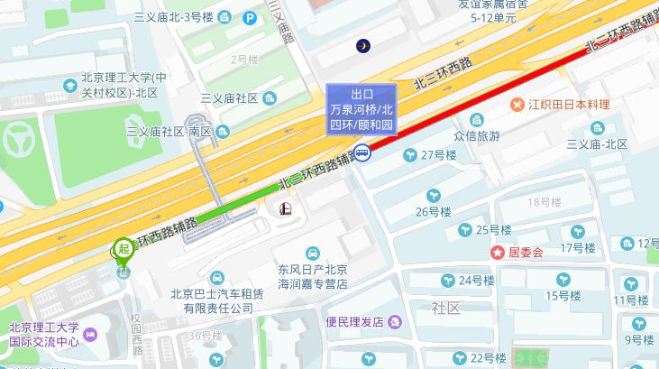
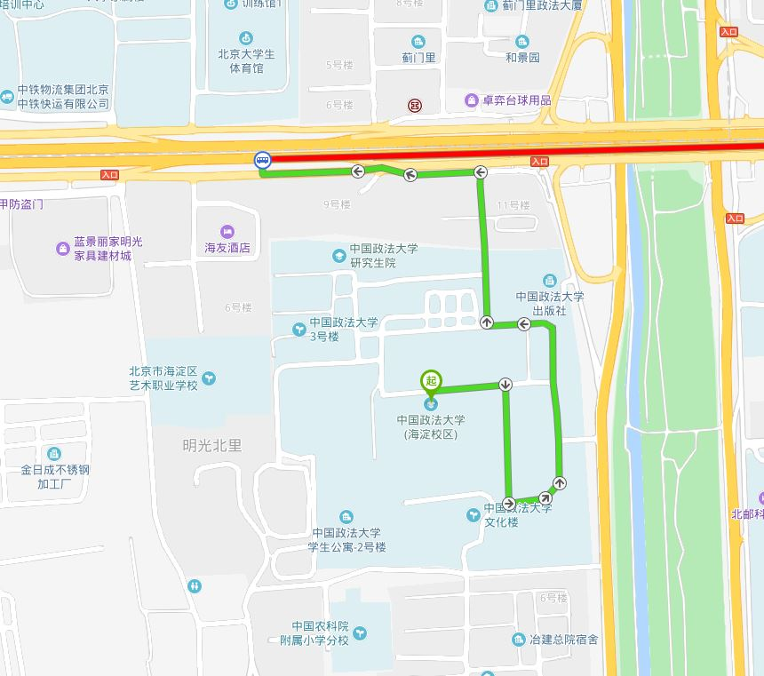

### 出发时间
7点或者8点

### 回来时间  
h58:中国科学院大学 &rArr; 庙城东：  41分钟+10分钟  
916：最晚18：50  

17：40 之前得动身回来/滴滴18：10  

如果实在晚了  
K7712： 怀柔到北京（22：37-23：41）


### 所需公交：
  
|公交|始发时间|末班时间|班次间隔|
|---|---|---|---|
|特8（内环）（去）|05:00|21:30||
|916（去）|05：50|19：50||
|h58（去）|05：45|20：15|40min|
|h11(去cau)|06:00|18:00|~20min|
|h58路青龙峡(去cau)|05:00|19:30||
|h33路(去cau)|||
|h58路青龙峡(回)|05:00|19:30||
|916（回）|04:50|18:50||
### 去滑雪场 (大约3小时)
[路线](#bit_ski)
  
  北京理工大学北门(特8路-三义庙站)(上车)  
  [公交站位置](#bit_nd)  
  5站  
  中国政法大学北门（蓟门桥西）（上车）  
  [公交站位置](#pl_nd)

  特8路-西坝河站(下车)  
  [换乘图](#s8_916)  
  916-西坝河站（上车）  
    6站  
  916-明珠广场站（下车）  
  [换乘图](#916_h58)   
  h58-明珠广场站（上车）  
    22站  
  h58-九谷口站（下车）  


### 去中科院大学(大约半小时)

[路线](#ski_cau)

公交选项：h11、h33、h58 (可从九谷口站上车)  
青龙峡道口站（上车）  
  1站  
怀北庄站（下车）  

### 回京  

h58/h58青龙峡 &rArr;   916(庙门东)  &rArr; 特8/302 (西坝河)  
```
从学校去怀柔，坐小黑车或者滴滴一般半个小时吧，公交算上等的时间可能要提前一个小时  
```
[班车时间](#schoolBus)(最晚3.30基本可以毙掉)

K7712： 怀柔到北京（22：37-23：41）

----

<div id="bit_ski"></div>
北理工到滑雪场


<div id="bit_nd"></div>
北理工北门公交站  



<div id="pl_nd"></div>
政法大学北门公交站   



<div id="s8_916"></div>  
特8转乘916  


<div id="916_h58"></div>
916转乘h58


<div id="ski_cau"></div>
滑雪场到中科院大学


<div id="schoolBus"></div>
中科院大学班车  


